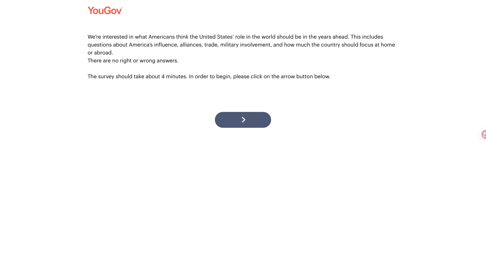
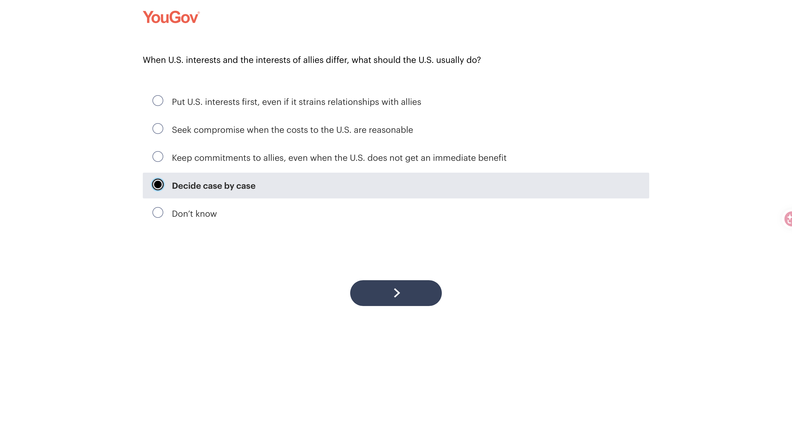
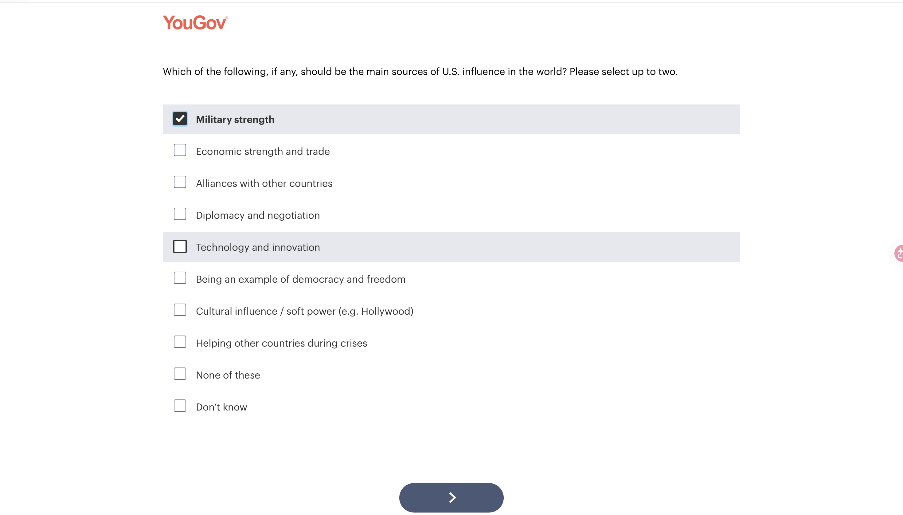
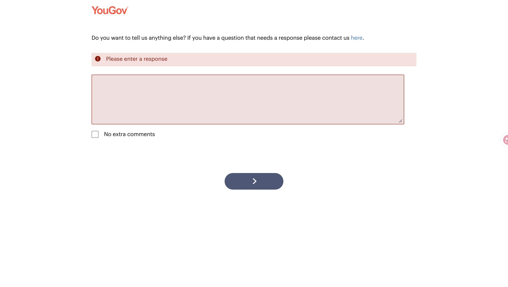

# Consumer Panel Experience

For this assignment, I signed up for **YouGov** and participated in a survey as a consumer panel member. Before doing the survey, I also watched the assigned video about one person's experience using YouGov.

From the video, I learned that YouGov matches participants with surveys based on some of the information they provide when signing up. The surveys can cover many different topics, such as politics, current events, entertainment, consumer behavior, health, and technology. Participants receive points for completing surveys, and those points can later be exchanged for rewards.

What interested me more for this assignment was seeing the survey from the participant's side. While taking the survey, I paid attention to the wording, response choices, instructions, and features that either made the survey easier to answer or made me think about how the question could be improved.

# Survey Design Observations

## 1. Clear Introduction Before the Survey

{fig-cap="Introduction shown before the YouGov survey."}

I liked how the survey gave a short introduction before asking the actual questions. It explained that the survey was about Americans' views on the United States' role in the world, including topics such as alliances, trade, military involvement, and whether the country should focus more at home or abroad.

One sentence that stood out to me was **"There are no right or wrong answers."** Since the survey asked about political opinions, I think this sentence was helpful. Political questions can sometimes make respondents feel that there is a more acceptable or correct answer. This sentence reminded me that the survey was asking for my own opinion.

I also liked that the introduction estimated that the survey would take about **4 minutes**. As a participant, knowing the expected time before starting made the survey feel more manageable.

This showed me that even a short introduction can prepare participants for the survey and make them feel more comfortable answering opinion-based questions.

## 2. Providing Different Types of Response Options

I also liked how this question provided several different ways to answer instead of only giving two completely opposite choices.

For example, besides options that represented stronger positions, it also included **"Decide case by case"** and **"Don't know."** I think these options are useful because not everyone has one fixed opinion about a topic. Some people may think their answer depends on the situation, while others may not know enough about the issue to choose a position.

One thing I might consider adding is an **"Other (please specify)"** option. Even though the current answers cover several different views, there could still be respondents whose opinions do not fit any of the choices. A short text box could give those participants a way to explain their view instead of choosing the closest available answer.

This question reminded me that response options should give participants enough flexibility so they do not feel forced into an answer that does not really represent what they think.

## 3. Instructions for Multiple-Response Questions

This question asked respondents to select **up to two** sources of U.S. influence in the world.

At first, I thought I needed to choose two options. I selected only one answer and noticed that the survey still allowed me to continue. After reading the instruction again, I realized that **"up to two"** means that choosing either one or two answers is acceptable.

I actually think this gives respondents useful flexibility. If someone strongly believes that only one choice represents their opinion, the survey does not force them to select a second option just to continue.

This question also reminded me that instructions for multiple-response questions have to be very clear. **"Select up to two," "select exactly two,"** and **"select all that apply"** may look similar, but they lead to very different response behavior. The validation setting in the survey should also match the wording of the instruction.

## 4. Required Response with an Easy Opt-Out

This was one of the survey design features I liked the most.

The question gave respondents a text box for additional comments. When I tried to continue without typing anything or selecting an option, the survey showed a warning saying **"Please enter a response"** and did not allow me to move forward.

However, the survey did not force me to type something just for the sake of answering. If I had nothing else to say, I could select **"No extra comments"** and continue.

I think this is a good design because it makes sure the respondent gives an intentional response instead of accidentally skipping the question. At the same time, it does not require people to create an unnecessary answer when they really have nothing to add.

This made me think more carefully about required questions. Making a question required can help reduce missing data, but respondents should still have a reasonable option such as **"None," "Not applicable,"** or **"No extra comments"** when appropriate.

# Lessons Learned

Participating in the YouGov survey helped me notice several small design choices that I probably would not have paid much attention to if I were only looking at the survey from the researcher's side.

One lesson I learned is that **clear instructions matter a lot**. Even a phrase like "up to two" can change how respondents answer a question. The instructions and the survey validation should match so that participants understand exactly what they are expected to do.

I also learned that **response options should not force people into an answer**. Options such as "Don't know," "Decide case by case," or "Other" can be useful when respondents do not fit neatly into the main choices.

Another lesson is that **required questions need to be designed carefully**. I liked the way YouGov required a response to the extra-comments question but still included "No extra comments." It prevents accidental skipping without forcing participants to write something meaningless.

Finally, I learned that the **overall survey experience matters**, not just the individual questions. Giving respondents a short introduction, explaining the topic, saying there are no right or wrong answers, and estimating how long the survey will take can make the survey feel clearer and easier to complete.

# Application to Our Research Project

These lessons are useful for our **PhD Orthodontics** research project. My analytics objective focuses on identifying website content gaps, patient information needs, and content opportunities that can support prospective-patient engagement and lead generation.

If we collect primary data from prospective patients, we need to make sure our questions are easy to understand and that the response options match what we are trying to measure.

For example, if we ask participants what information they want to see on an orthodontic website, we could allow them to select several choices but clearly explain the limit:

> Which types of information would be most useful to you when considering an orthodontic practice? Please select up to three.

If we want respondents to choose only their most important need, we should instead say:

> Which ONE type of information would be most important to you when considering an orthodontic practice?

The wording should match what we actually want to learn.

I would also avoid combining several ideas into one question. For example, instead of asking:

> How useful, complete, and trustworthy is the information on this orthodontic website?

I would separate the ideas:

> How useful is the information on this website when deciding whether to contact the orthodontic practice?

> How complete does the information on this website seem?

> How trustworthy does the information on this website seem?

This would make each response easier to interpret.

I would also consider adding options such as **"Not sure," "Not applicable,"** or **"Other (please specify)"** when they make sense. These options can help participants answer more accurately instead of choosing something that does not really fit them.

# Appendix

- GitHub Repository
- Published HTML on GitHub Pages
