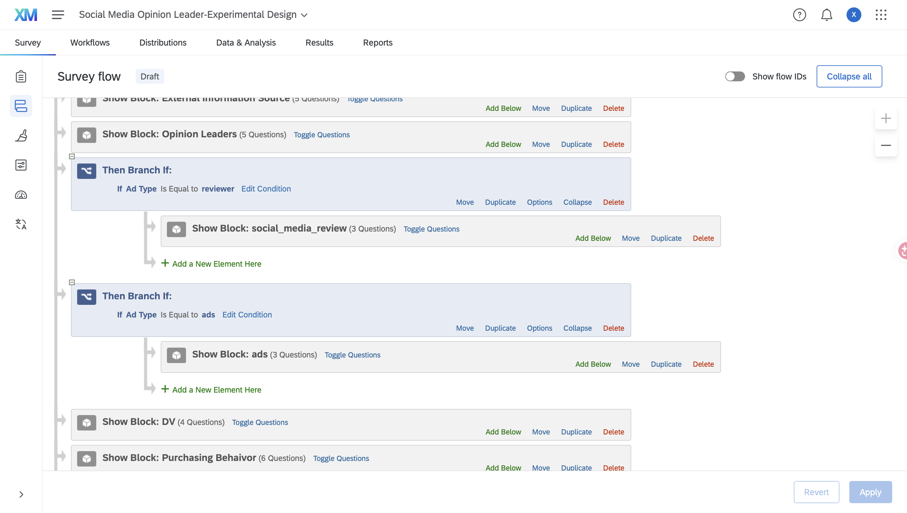
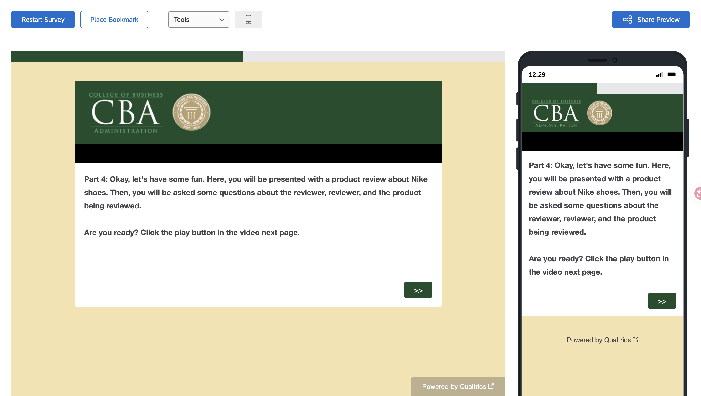

# Project Setup

The project was renamed to **Social Media Opinion Leader-Experimental Design**.

# Survey Structure

I reviewed the survey blocks and focused on the three experimental blocks:

- `social_media_review`
- `ads`
- `DV`

The goal is to show each participant only one experimental condition and then ask everyone the same dependent-variable questions.

# Random Assignment

## Randomizer Setup

I added a Randomizer in Survey Flow and set it to randomly present 1 of 2 conditions.

The two embedded-data values are:

- `Ad Type = reviewer`
- `Ad Type = ads`

## Branch Logic

I added two branches:

- If `Ad Type = reviewer`, show the `social_media_review` block.
- If `Ad Type = ads`, show the `ads` block.

The `DV` block appears after the two branches so all participants receive the same dependent-variable questions.

## Randomization Test

I tested the survey several times in Preview mode to confirm that the random assignment worked.

### Reviewer Condition

In one preview run, I was assigned to the `social_media_review` condition.

### Ads Condition

In another preview run, I was assigned to the `ads` condition.

The two preview runs confirmed that participants are assigned to only one experimental condition at a time.

# Platform-Specific Social Media Usage

## Problem with the Original Question

The original question measured total time spent on social media, so it could not show how much time respondents spent on each individual platform.

## Multiple-Answer Platform Question

I changed Q2.2 to:

> **Which of the following social media platforms do you currently use? Select all that apply.**

The question allows multiple answers.

## Carry Forward Matrix

I added a matrix question asking:

> **About how much time do you spend on each of the following social media platforms per day?**

The response options are:

- Less than 1 hour per day
- 1–2 hours per day
- 3–4 hours per day
- 4–5 hours per day
- 5 or more hours per day

The selected platform choices are carried forward from Q2.2.

## Display Logic for the Matrix

I added Display Logic so the matrix only appears when at least one named social media platform is selected. This prevents an empty matrix from appearing when a respondent selects only Other.

## Piped Text for "Other"

If a respondent selects Other, a separate question appears using Display Logic.

The text entered under Other is inserted into the follow-up question using Piped Text.

For example, if the respondent enters `WeChat`, the follow-up question becomes:

> **About how much time do you spend on WeChat per day?**

# Additional Survey Improvements

## Improvement 1: Matrix Statement Randomization

I randomized the statement/source order in selected matrix questions such as Q3.2, Q3.4, Q4.2, Q4.3, and Q8.3.

The response scale remains in the same order, but the source rows appear in a different order for respondents. This helps reduce possible order or position effects. For example:

## Improvement 2: Request Response for DV Questions

I enabled Request Response for Q7.1–Q7.4.

These questions measure important outcomes such as spokesperson perceptions, product perceptions, purchase intention, and sharing intention. Request Response reminds participants if they accidentally skip a question, but still allows them to continue.

## Improvement 3: Other Text Entry in Demographics

I changed the fixed `Others` option in the Q9.4 demographic question to:

> **Other (please specify)**

with a text-entry box. This allows respondents to provide a more specific response if none of the listed categories apply.

## Improvement 4: Consistent Low-to-High Response Scale

I revised the likelihood scale so the response options move from low to high:

1.  Very unlikely\
2.  Unlikely\
3.  Neutral\
4.  Likely\
5.  Very likely

This makes the scale easier to follow and keeps higher numeric values associated with higher likelihood.

# Appendix

- [GitHub Repository](https://github.com/Sheilaaa0312/Qualtrics-M02-Setting-up-an-Experimental-Design)
- Published HTML on GitHub Pages
